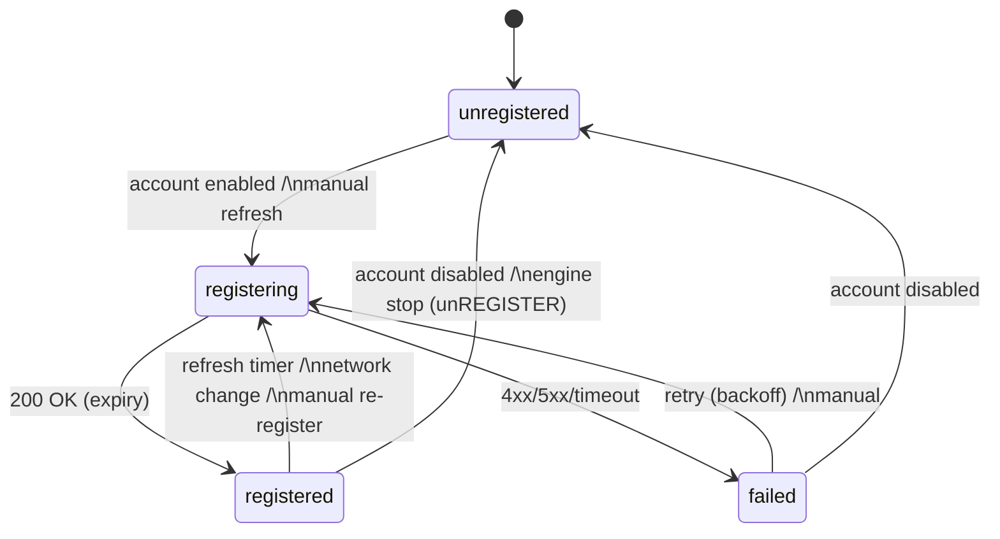
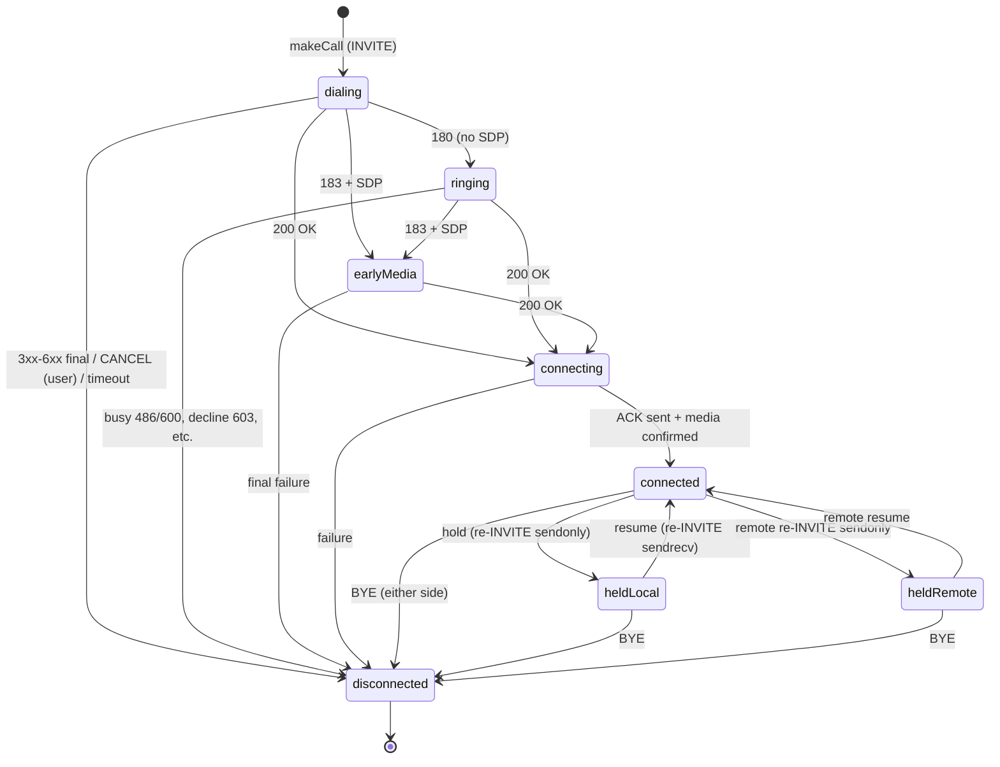
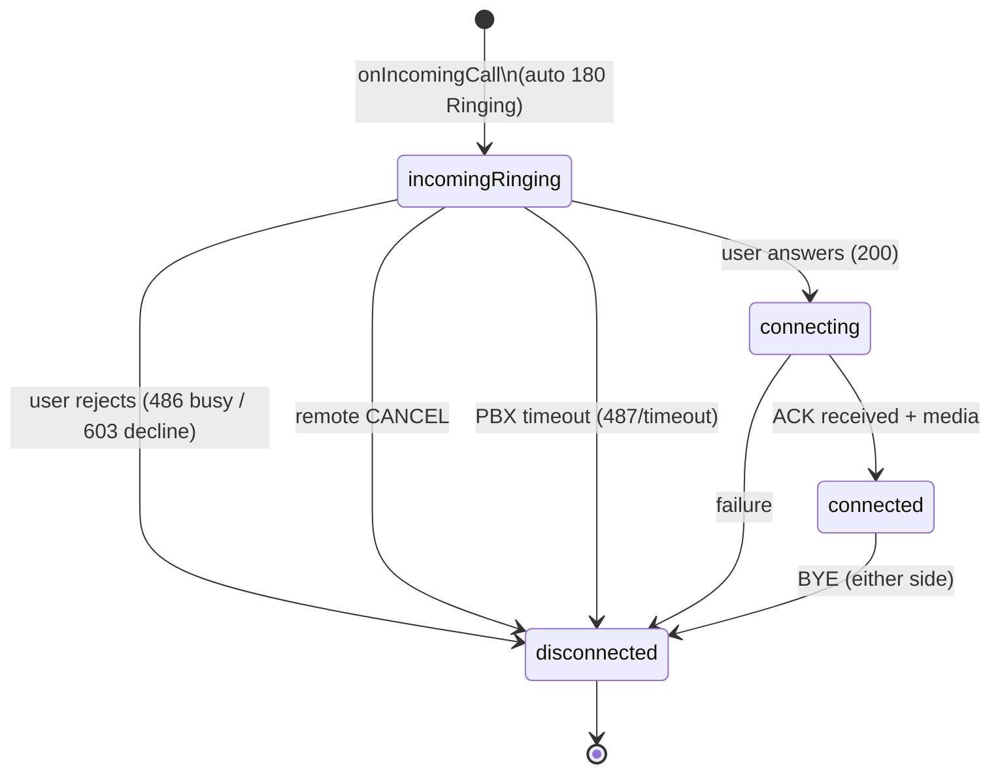

# SIP state machines

Authoritative behavior contracts. Implementations (Domain validators + the
SIPCore bridge) must match these diagrams; changes land in the same commit
as the code they describe. Milestone 1 documents: registration, outgoing
call, incoming call. Later milestones append their machines (hold across
multiple calls, transfer, conference, recording, video, shutdown).

Conventions: PJSIP invite states map as `CALLING→dialing`,
`EARLY→ringing/earlyMedia (outgoing) or incomingRinging (incoming)`,
`CONNECTING→connecting`, `CONFIRMED→connected`, `DISCONNECTED→disconnected`.
`disconnected` is **terminal**: any event arriving for a terminal call is
dropped by ID lookup (stale-callback guard, CLAUDE.md threading rule 4).

## Registration

| Transition | Trigger | PJSUA2 | Notes |
|---|---|---|---|
| unregistered→registering | enable/refresh | `Account::create(cfg)` / `setRegistration(true)` | password fetched from Keychain at this moment only, passed transiently into `AccountConfig`, never stored in Domain/Persistence |
| registering→registered | `onRegState` code 200, expiration > 0 | callback | store expiry; UI shows registered + account |
| registering→failed | `onRegState` non-2xx or PJSIP timeout status | callback | keep raw code + reason for diagnostics; user text via `SIPStatusMapping` |
| registered→registering | refresh/re-register | pjsua auto-refresh or `setRegistration(true)` | network change / wake triggers manual path |
| registered→unregistered | disable | `setRegistration(false)` then account shutdown | teardown order per bridge contract |

Races guarded: `onRegState` after account removal → dropped (account
registry lookup fails); duplicate terminal events ignored.

## Outgoing call

| Event | Mapping |
|---|---|
| User hangs up pre-answer | `Call::hangup()` → CANCEL; reason `cancelled` |
| User hangs up post-answer | BYE; reason `normal` |
| Remote final failure | reason `busy` (486/600), `rejected` (603), else `failed(code)`; user text via `SIPStatusMapping` (404 must read "Number not found") |
| Media | `onCallMediaState` → conf-bridge connect both directions; `mediaActive` flag on the snapshot; mute = disconnect mic→call (tx) without touching state machine |

Races guarded: hangup racing 200 OK (PJSIP resolves; we accept either
`disconnected(cancelled)` or brief `connected→disconnected`); duplicate
DISCONNECTED dropped; hold request only legal from `connected` —
Domain validator rejects otherwise and the bridge never sends the re-INVITE.

## Incoming call

| Event | Mapping |
|---|---|
| `onIncomingCall` | Bridge creates the call object on the callback thread, hops to the engine context to register it, answers 180, then emits the event (UI never sees a call the engine can't operate on) |
| Answer | `answer(200)`; mic permission must already be granted or is requested first — answering with denied mic yields a documented no-audio state, never a crash |
| Reject | `answer(486)` for busy, `answer(603)` for decline |
| Remote CANCEL vs local answer race | PJSIP arbitrates; if answer loses, we emit `disconnected(cancelled)` — UI must handle answer-tap followed immediately by disconnect |

## History recording (M1 basic)

Every call reaching `disconnected` produces exactly one history entry:
direction, remote URI/display name, start time, connect time (nil if never
connected), end time, computed ring/talk durations, final state reason,
raw SIP code (diagnostics), account. Unanswered/failed calls show their
outcome, never a zero talk duration.
